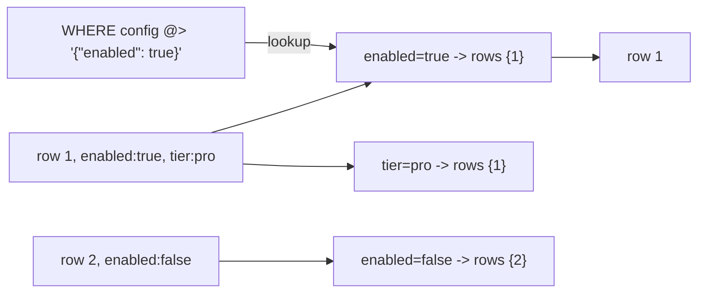
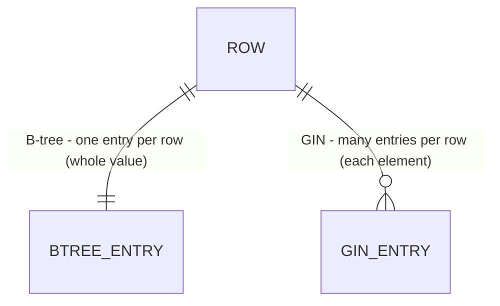
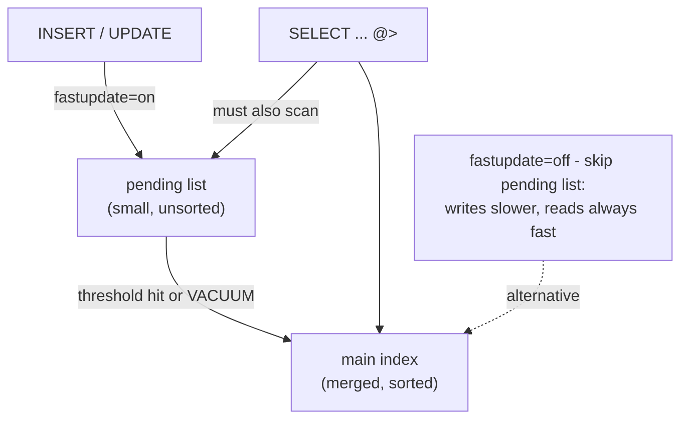

# GIN - Generalized Inverted Index



GIN indexes the elements inside each value (like words -> documents), so a containment lookup jumps straight to the
matching rows.

## What it is

An inverted index: instead of indexing a whole value, it indexes each element inside a composite value and maps it back
to the rows that contain it - the same idea a search engine uses to map words to documents. GIN powers fast lookups on:

- JSONB - containment (`@>`), key existence (`?`)
- arrays - overlap (`&&`), contains (`@>`)
- full-text search - `tsvector` matched with `@@`
- hstore and trigram (`pg_trgm`) text similarity

### GIN vs B-tree

Different jobs, not competitors:

- B-tree indexes a whole scalar value for `=`, `<`, `>`, ranges, and `ORDER BY`. It's the default and the right choice
  for ordinary columns.
- GIN indexes the pieces inside a value for "does this contain X?" questions. It can't help with ordering or range scans
  on the value as a whole.



The cardinality is the whole story: B-tree keeps one entry per row (good for ordering and ranges); GIN explodes each
value into many entries (good for "contains?" questions).

You don't always have to choose between them. The `btree_gin` extension adds GIN operator classes for ordinary scalar
types, so a single multicolumn GIN index can combine a plain column with a JSONB or array column - e.g.
`(tenant_id, config)` serving `WHERE tenant_id = 5 AND config @> '{"enabled": true}'` in one index.

## Why it matters

Without an index, `WHERE config @> '{"enabled": true}'` or `WHERE tags && '{urgent}'` is a sequential scan - every row
deserialized and checked. A GIN index turns those into fast lookups, which is what makes PostgreSQL's JSONB genuinely
usable as a document store rather than a novelty.

```sql
CREATE INDEX ON feature_flags USING gin (config);
SELECT name FROM feature_flags WHERE config @> '{"enabled": true}';
```

## vs other databases

MySQL has full-text and multi-valued indexes (8.0.17+), SQL Server has full-text plus JSON functions (but no native
indexed JSONB type), Oracle has domain indexes. GIN is the general mechanism behind PostgreSQL's strong JSONB, array,
and search story - one index type serving many use cases.

## Trade-offs

- Slower writes: one row can produce many index entries, so inserts/updates cost more than B-tree. GIN buffers new
  entries in a "pending list" (`fastupdate`) to soften this - at the cost of slower reads until that list is merged into
  the main index (more on this below).
- Results may need rechecking: GIN often returns candidate rows that the executor re-checks against the actual heap
  tuple (the `Recheck Cond` you see in `EXPLAIN`), so it doesn't always jump straight to exact matches. Whether the
  index test is exact depends on the operator class - `jsonb_path_ops`, for instance, stores hashes of paths, so every
  match is rechecked to rule out hash collisions.
- On-disk size is data-dependent: GIN compresses its posting lists and stores each key once, so it can be smaller than a
  B-tree when element values repeat, but larger when elements are highly unique.
- Best for read-heavy JSONB / array / full-text workloads.
- `jsonb_path_ops` is a smaller, faster GIN variant - but it indexes only containment (`@>`). Key-existence queries (`?`,
  `?|`, `?&`) silently fall back to a sequential scan, so stick with the default `jsonb_ops` if you need those.
- GiST is the alternative index for ranges, geometry, and nearest-neighbor - GIN and GiST cover different type families.

## Nuances

### The pending list (`fastupdate`)



With `fastupdate` on (the default), writes land cheaply in the pending list, but every read must scan both that list and
the main index until the next merge. High-read workloads often disable `fastupdate` to avoid that extra scan.
