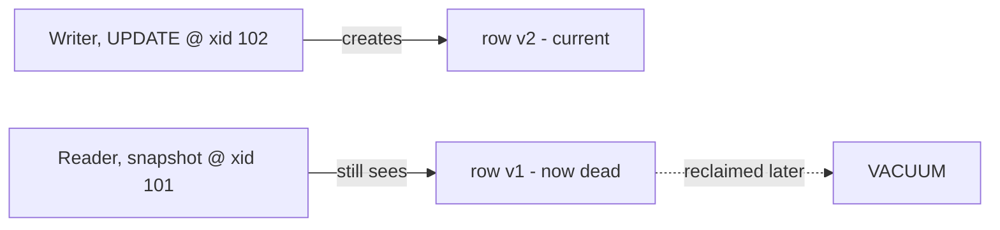
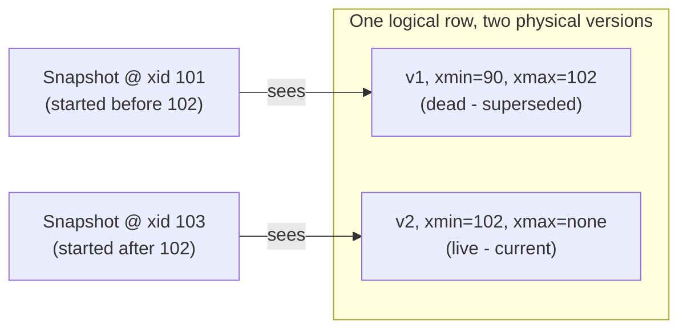
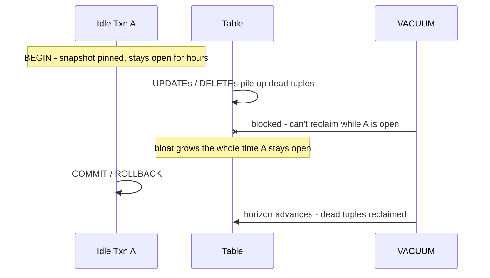
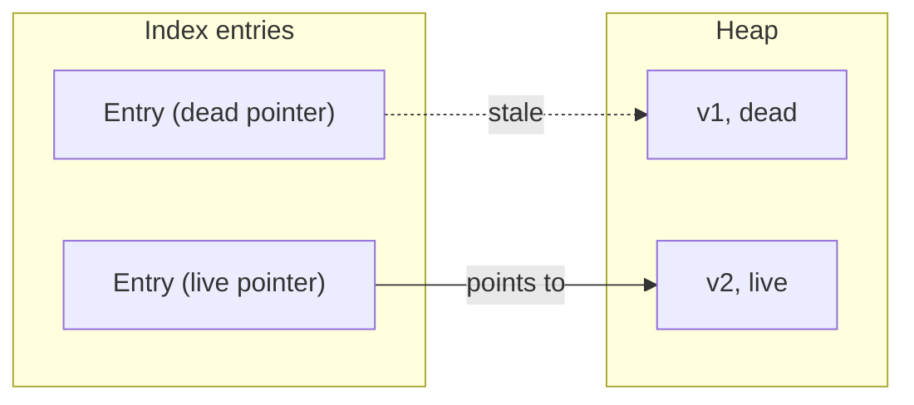
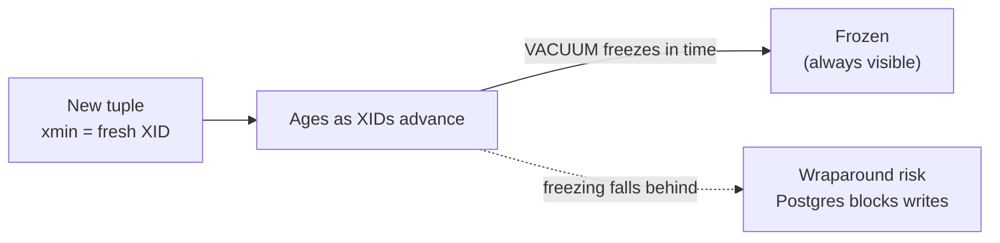
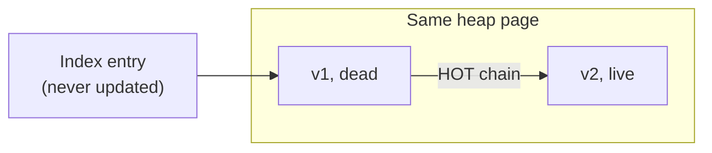

# MVCC - Multi-Version Concurrency Control

Writers add a new row version; older readers keep seeing the old one - neither blocks. The dead version waits for
VACUUM.

## What it is

Every transaction sees a consistent snapshot of the data as it existed when the transaction (or statement) started.
Writers don't overwrite rows in place - they write a new version and mark the old one dead. Each row carries hidden
`xmin`/`xmax` columns (the transaction IDs that created and deleted that version); a transaction's snapshot decides
which versions are visible to it. (Under the default READ COMMITTED isolation, each statement takes a fresh snapshot;
REPEATABLE READ and SERIALIZABLE hold one snapshot for the whole transaction.)

The hidden `xmin`/`xmax` stamps are all PostgreSQL needs: `xmin` is the transaction that created a version, and
`xmax` is the transaction that deleted it. A snapshot shows a version when its `xmin` committed before the snapshot
began and its `xmax` hasn't committed as of the snapshot, so the snapshot taken before 102 committed still sees
v1, while a later one sees v2.

## Snapshot visibility

A PostgreSQL snapshot records which transactions were already committed when the snapshot was taken and which were
still in progress. The visibility rule is simple:

- A version is visible if its `xmin` committed before the snapshot.
- A version is invisible if its `xmax` committed before the snapshot.
- A version is also invisible if its `xmax` is a transaction that was still active when the snapshot was taken.

That is why a snapshot taken before XID 102 was visible to a reader even after the update created version 2.

## Why it matters

MVCC makes PostgreSQL feel fast and responsive under concurrency by giving each transaction a stable view of the data
without taking read locks.

- A long-running report doesn't freeze inserts and updates.
- A bulk import doesn't block reads.
- `pg_dump` takes a consistent backup without blocking writers, even during peak traffic.
- Two sessions can work the same table at once without waiting on each other.

This is the default behavior, not an opt-in mode.

## vs other databases

- SQL Server (default, without `READCOMMITTEDSNAPSHOT`): `SELECT` takes shared locks that block `UPDATE`.
A reporting query can stall writes for minutes. Enabling RCSI gives you essentially MVCC - but it's opt-in.
- MySQL/InnoDB and Oracle are also MVCC (via undo logs / rollback segments) rather than versioned heap tuples.
Same guarantee, different machinery, and different cleanup costs.

## The trade-off

### Dead tuples and cleanup

An idle transaction pins the cleanup horizon: dead tuples can't be reclaimed until it ends - so one forgotten session
bloats the whole database.

MVCC leaves dead tuples (old row versions) behind on every UPDATE and DELETE. They have to be reclaimed, which is what
VACUUM does. The catch: VACUUM can't remove a dead version while any open transaction might still need to see it. That's
how a single idle session causes bloat across the whole database. This is the operational tax you pay for lock-free
reads.

VACUUM normally runs automatically (autovacuum) in the background. Plain `VACUUM` reclaims dead space for reuse
by the same table; only `VACUUM FULL` returns it to the OS — but that rewrites the whole table under an exclusive
lock, so it's a last resort, not routine maintenance.

### Indexes bloat too

Bloat isn't only a heap problem. Every index entry points at a specific row version, so each dead heap tuple can leave
dead pointers behind in every index on the table. VACUUM has to sweep the indexes as well as the heap, and a
heavily-updated index can bloat faster than the table itself - degrading the very index scans MVCC was supposed to keep
fast. `REINDEX` (or `REINDEX CONCURRENTLY`) rebuilds a bloated index from scratch.

### Transaction ID wraparound

Those `xmin`/`xmax` stamps are 32-bit transaction IDs - only ~4 billion of them, treated as a circular space where
"older" and "newer" are relative to the current XID. If an ancient tuple's `xmin` were ever allowed to look like it sits
in the future, that row would abruptly turn invisible - silent data loss. To prevent this, VACUUM also freezes old
tuples: it marks them as permanently visible so their age stops mattering.

If freezing falls too far behind - usually because autovacuum is starved, disabled, or held back by a long-lived
transaction - Postgres escalates to an aggressive anti-wraparound VACUUM, and as a last resort refuses new writes
entirely until you VACUUM manually. It's a catastrophic, Postgres-specific failure mode with a simple defense: let
autovacuum run, monitor `age(datfrozenxid)`, and tune `autovacuum_freeze_max_age`.

## Nuances

### HOT updates - dodging index bloat

Not every UPDATE costs the same. An UPDATE normally writes a new heap version and a new entry in every index - even
indexes on columns that didn't change. HOT (Heap-Only Tuple) updates avoid that: when the changed columns aren't indexed
and the new version fits on the same page, Postgres chains the new tuple to the old one in the heap and skips the index
writes entirely. The index keeps pointing at the old slot and follows the chain to the live version.

An update qualifies as HOT only when both conditions hold:

- No indexed columns are modified. The UPDATE touches only columns that aren't part of any index on the table -
  including expression indexes and partial-index predicates.
- The page has enough free space. The 8 KB heap page holding the old row has room for the entire new version, so
  the new tuple stays on the same page.

The payoff: fewer index entries to write now, and fewer dead pointers to VACUUM later. It's also why a `fillfactor`
below 100 helps update-heavy tables - leaving free space on each page keeps updates HOT instead of forcing them onto
a new page (which breaks the chain and requires index writes again).
