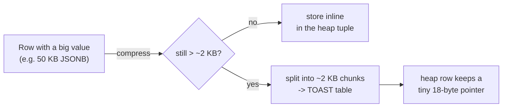
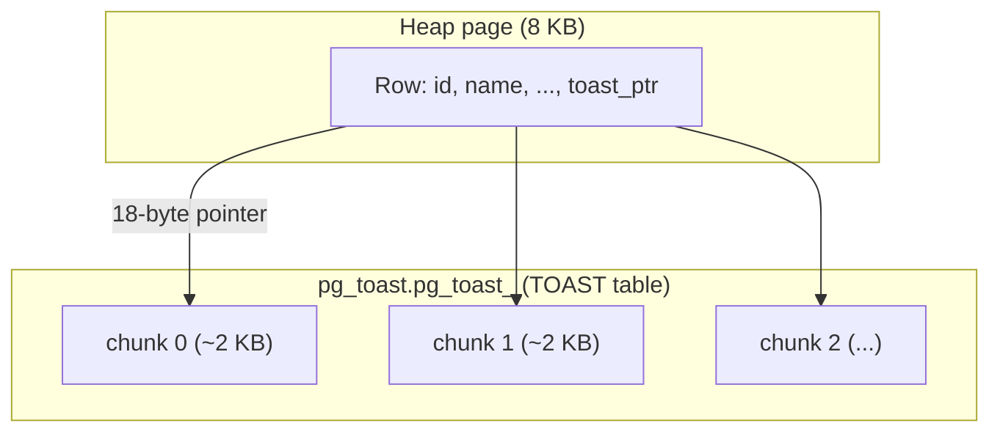
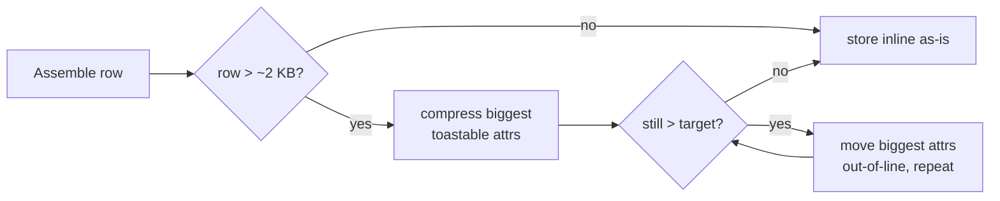

# TOAST - The Oversized-Attribute Storage Technique



A value too big to fit a row gets compressed and, if still large, pushed out-of-line into a side table; the heap row
keeps only a pointer.

## What it is

PostgreSQL stores rows in fixed 8 KB pages, and a single row (tuple) is not allowed to span multiple pages. That
leaves a hard problem: how do you store a 50 KB JSONB document, a 1 MB text blob, or a big array in a page a
quarter that size? TOAST is the answer, and it runs automatically for every table that has a variable-length
("toastable") column: `text`, `varchar`, `jsonb`, `bytea`, arrays, and similar types.

When a row is too wide to fit comfortably (PostgreSQL aims to keep tuples under `TOAST_TUPLE_TARGET`, ~2 KB, so several
rows still fit per page), it applies two tools in order:

- Compress the oversized attribute in place.
- Move it out-of-line if it's still too big; the value is sliced into ~2 KB chunks and written to a separate,
  system-owned TOAST table (one per base table, living in the `pg_toast` schema with its own index). The heap tuple
  keeps only a small TOAST pointer (18 bytes) referencing those chunks.

All of this is transparent: you `INSERT` and `SELECT` normally, and PostgreSQL compresses, splits, reassembles, and
decompresses ("detoasts") behind the scenes.

### Per-column storage strategies

Each column has a storage strategy that controls which of the two tools TOAST is allowed to use. Set it with
`ALTER TABLE ... ALTER COLUMN ... SET STORAGE ...`:

| Strategy   | Compress? | Move off-row? | Typical use                                        |
| ---------- | --------- | ------------- | -------------------------------------------------- |
| `PLAIN`    | no        | no            | fixed-length types that can't be TOASTed (`int`)   |
| `MAIN`     | yes       | last resort   | keep compressed value inline when possible         |
| `EXTENDED` | yes       | yes           | default for most toastable types (`text`, `jsonb`) |
| `EXTERNAL` | no        | yes           | skip compression for fast substring/random access  |

`EXTERNAL` is the interesting one: uncompressed out-of-line values support fast substring reads (`substr()` on a big
`text`/`bytea`) because PostgreSQL can fetch only the chunks it needs instead of decompressing the whole value.



The big value lives as numbered chunks in a side table; the heap row you scan stays small and pointer-sized.

## Why it matters

TOAST is why a "row" can hold a megabyte-sized document without breaking the page model, and, more importantly, why doing
so doesn't wreck the performance of queries that don't touch the big column. Out-of-line values are only fetched and
decompressed when that specific column is read, so a `SELECT id, status FROM docs WHERE ...` scans small heap tuples and
never pays for the 50 KB `body` sitting off-page.

```sql
CREATE TABLE docs (id bigint primary key, status text, body jsonb);

SELECT id, status FROM docs WHERE status = 'active';

SELECT body FROM docs WHERE id = 42;
```

It's also what makes PostgreSQL's document-store story (large JSONB) and blob storage practical at all: the same table can
hold narrow relational columns and fat payloads without you managing separate blob storage.

## vs other databases

Every row-store hits the same "value bigger than a page" wall and solves it with off-page storage; TOAST's
distinction is that it's automatic, transparent, and applies uniformly to any variable-length type.

- MySQL/InnoDB stores large `TEXT`/`BLOB` (and long `VARCHAR`) in overflow pages; how much stays on the main page
  depends on the row format (`DYNAMIC`, `COMPRESSED`, `COMPACT`). Compression is a table-level row-format choice, not a
  transparent per-value step.
- SQL Server uses row-overflow pages for oversized variable-length columns and separate LOB storage for
  `varchar(max)`/`nvarchar(max)`/`varbinary(max)`.
- Oracle stores LOBs out-of-line (or inline under a threshold) via LOB segments.

The PostgreSQL-specific flavor: TOAST is invisible plumbing you rarely configure, compression is per-value, and it kicks
in for ordinary columns (a wide `text` or `jsonb`), not just declared LOB types.

## Trade-offs and gotchas

- `SELECT *` detoasts everything. Selecting a large column pays the cost of fetching every chunk from the TOAST table
  and decompressing it. Project only the columns you need; a habitual `SELECT *` on a table with fat JSONB is a silent
  performance tax.
- The TOAST table bloats and needs VACUUM too. It's a real table with dead tuples and its own index. An
  update-heavy large column can bloat its TOAST table faster than the parent, and it's easy to miss because it's hidden
  in `pg_toast`. (An UPDATE that leaves the toasted column unchanged reuses the existing out-of-line value rather than
  rewriting it, so churn comes from actually modifying big values.)
- Compression costs CPU. `lz4` beats the default `pglz` on speed for a similar ratio (see below), and
  already-compressed payloads (images, gzipped blobs) don't shrink, so use `EXTERNAL` to skip the wasted attempt.
- Detoasting hides in query plans. The heap scan can look cheap while the real time goes to reassembling and
  decompressing out-of-line values, work that doesn't always show up clearly in `EXPLAIN`.
- 1 GB per field, still. TOAST raises the ceiling to a 1 GB per-value hard limit, not to infinity. Genuinely huge
  objects (multi-GB files) belong in object storage with a reference in the row, not in the column.
- Indexing the whole big value is impractical. You typically index inside it (a GIN index on `jsonb`, an
  expression index on a substring) rather than the full detoasted value, which a B-tree can't hold past its own page
  limits anyway.

## Nuances

### When the threshold actually fires

TOAST only engages once a whole row exceeds `TOAST_TUPLE_THRESHOLD` (~2 KB); below that, even toastable columns stay
inline and uncompressed. PostgreSQL then compresses and/or evicts the largest toastable attributes one at a time until
the tuple drops under `TOAST_TUPLE_TARGET`. So a 500-byte `text` value is never TOASTed, and whether a mid-sized value
goes off-row depends on how wide the rest of the row is.



TOAST is threshold-driven and greedy: it shrinks and evicts the widest attributes one by one, and stops the moment
the row fits.

### pglz vs lz4

TOAST can compress with two algorithms. `pglz` is the historical built-in default; `lz4` (PostgreSQL 14+) is the
one you usually want.

|                  | `pglz`                       | `lz4`                                  |
| ---------------- | ---------------------------- | -------------------------------------- |
| Availability     | always built in              | PostgreSQL 14+ (compiled `--with-lz4`) |
| Compress speed   | slow                         | much faster (often 5-10x)              |
| Decompress speed | slow                         | much faster                            |
| Ratio            | slightly better on some text | slightly worse, usually close          |
| CPU cost         | high                         | low                                    |

`lz4` trades a sliver of compression ratio for a large CPU/latency win, so it's the better default on most
read-or-write-heavy workloads. Set it cluster-wide with `default_toast_compression`, or per column with `SET COMPRESSION`.

Two caveats: the change is not retroactive (it only applies to values written afterward, so a table can hold a mix
of `pglz`- and `lz4`-compressed rows until they're rewritten), and neither algorithm shrinks already-compressed
payloads (images, gzipped blobs), where `EXTERNAL` to skip compression is the better call.
