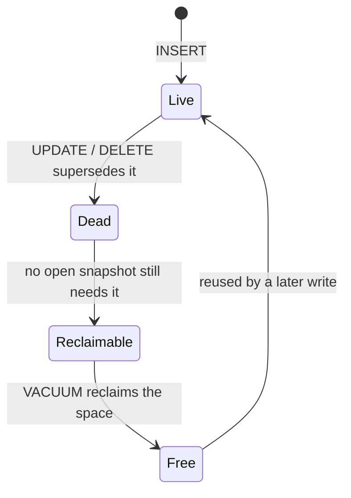
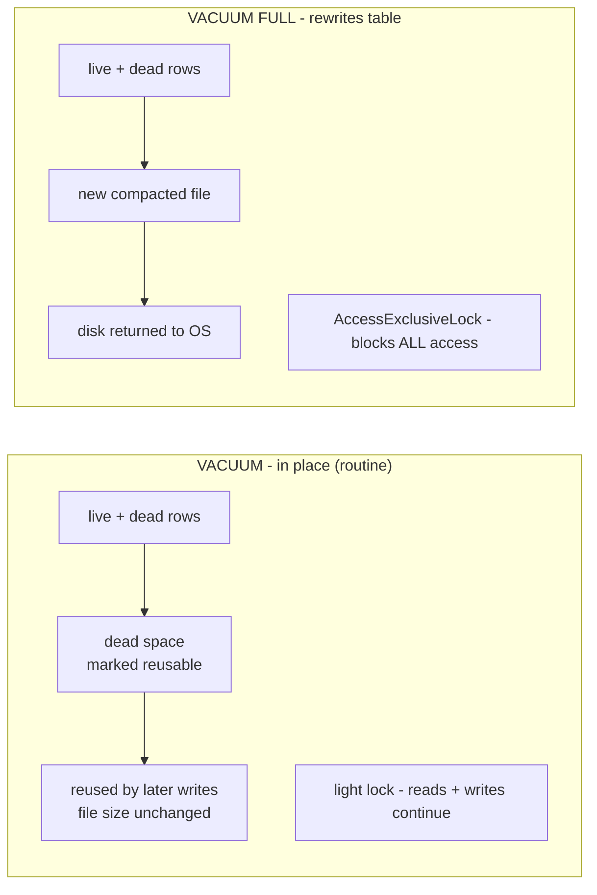

# VACUUM

The life of a row version: a change turns it into a dead tuple, and only VACUUM moves that space back into circulation.

## What it is

MVCC leaves dead tuples behind on every UPDATE and DELETE - the old row versions aren't removed immediately. VACUUM
reclaims that space so it can be reused, updates the visibility map (which marks all-visible pages so the planner can
use index-only scans - without it, every index hit must visit the heap just to check row visibility), and advances
the frozen-XID horizon to prevent transaction-ID wraparound. (Refreshing planner statistics is a separate job - that's
`ANALYZE`, which autovacuum also runs; plain `VACUUM` doesn't.)

autovacuum runs this automatically in the background. You rarely run it by hand - but you do need to understand it,
because on high-churn tables it can fall behind.

### VACUUM vs VACUUM FULL

- `VACUUM` marks dead space reusable in place. It takes only a light lock and runs concurrently with reads and
  writes. This is the routine one.
- `VACUUM FULL` rewrites the entire table to physically shrink it, and takes an `AccessExclusiveLock` - it blocks
  all access for the duration. Dangerous on a live table; reach for `pg_repack` instead when you must reclaim disk
  online.

Routine VACUUM frees space for reuse without blocking; VACUUM FULL shrinks the file on disk but locks the whole table.

## Why it matters

When autovacuum falls behind:

- Tables bloat - disk usage grows and sequential scans get slower because they wade through dead rows.
- Index-only scans stop paying off - a stale visibility map sends the planner back to the heap to check row
  visibility, so scans that should never touch the table start doing so anyway.
- The planner works from stale statistics and picks bad plans (autovacuum runs `ANALYZE` too, so it slips alongside
  vacuuming).
- In the worst case you approach transaction-ID wraparound, where PostgreSQL forces an emergency anti-wraparound
  vacuum (and, if ignored long enough, shuts down writes to protect data).

## vs other databases

MySQL (InnoDB purge thread) and SQL Server (ghost-record cleanup) reclaim versioned space too, but largely
invisibly. PostgreSQL surfaces it as a first-class operational concern. This is the unique maintenance tax of
PostgreSQL's MVCC design - the cost of getting lock-free reads.

## Trade-offs and gotchas

Autovacuum wakes every `autovacuum_naptime` (a minute by default) and vacuums a table only once its dead tuples pass
a threshold: `autovacuum_vacuum_threshold` + `autovacuum_vacuum_scale_factor` × the table's row count. The scale
factor defaults to `0.2`, so roughly 20% of the table must be dead before autovacuum touches it.

That percentage is the classic large-table trap: 20% of a 1,000-row table is nothing, but 20% of a 100-million-row
table is 20 million dead tuples of bloat before autovacuum even fires. The fix is per-table tuning - lower
`autovacuum_vacuum_scale_factor` (via `ALTER TABLE ... SET (...)`) on big, high-churn tables so they're vacuumed on
a sane cadence instead of waiting for a fixed fraction.

Long-running transactions are another culprit: VACUUM can't remove a dead version while the oldest open
transaction might still need it, so every row updated or deleted during that transaction's life stays on disk until
it ends - a single idle-in-transaction session quietly blocks cleanup cluster-wide. Bound it with
`idle_in_transaction_session_timeout`.

A second trap is over-throttling autovacuum: it deliberately paces its I/O (`autovacuum_vacuum_cost_delay` /
`cost_limit`), so raising the delay to be "gentler" makes it fall further behind on busy tables, not catch up.
