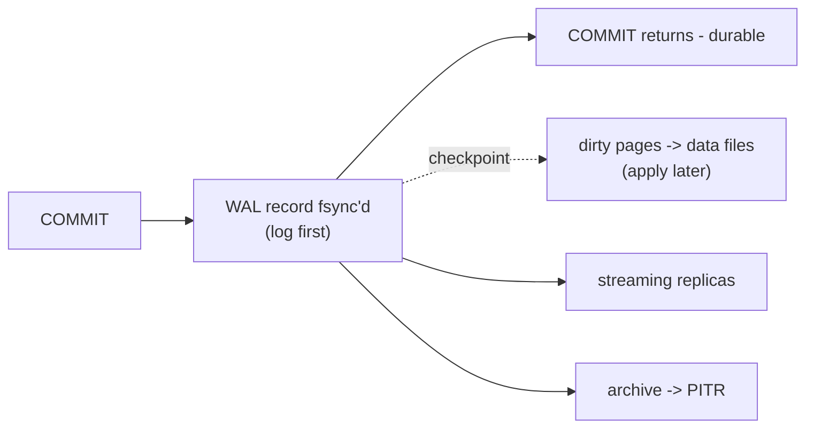
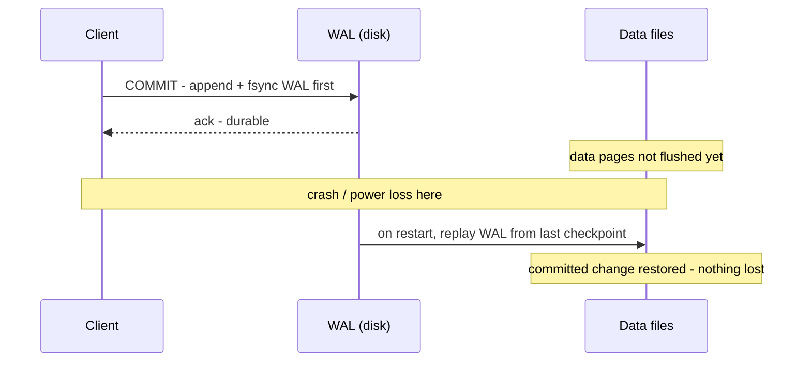

# WAL - Write-Ahead Log

The change is logged and flushed before it's applied - and that same log feeds crash recovery, replication, and PITR.

## What it is

Before any change touches a data page on disk, PostgreSQL first writes a record describing that change to a sequential
log and fsyncs it. Log first, apply later. A COMMIT returns only once its WAL record is durably on disk - that's the
"D" in ACID.

Periodically a checkpoint flushes dirty data pages from shared buffers out to the data files, after which the WAL
written before it can be recycled. WAL is stored as fixed-size segment files (16 MB by default), not one ever-growing
file.

Before a filled segment is recycled it can be copied somewhere durable first. With `archive_mode = on`, the archiver
process hands each completed segment to `archive_command` (a shell command that copies it to another disk, object
storage, etc.; PostgreSQL 15+ can use an `archive_library` instead). That archived stream, replayed on top of a base
backup, is exactly what point-in-time recovery rolls forward - so archiving requires `wal_level` to be at least
`replica`.

Every byte in the WAL stream has an address called an LSN (Log Sequence Number) - a monotonically increasing position
in the log. Segment file names encode the LSN, replicas report how far they've replayed as an LSN, and PITR targets a
specific LSN or timestamp. It's the coordinate system the whole WAL machinery is built on.

To survive a partial ("torn") page write - where a crash leaves a data page half-updated on disk - the first change to
each page after a checkpoint logs the entire page image, not just the row delta. These full-page writes are what make
replay safe even if the OS wrote only part of a page, and they're a big reason WAL volume spikes right after a
checkpoint.

WAL is a separate subsystem from the data files, not a slice of them:

- Memory: WAL buffers live in `wal_buffers`, a distinct shared-memory area from `shared_buffers` (the data-page cache) -
  sizing one doesn't shrink the other.
- CPU: generating WAL adds work on top of the query - record assembly, per-record CRC, optional `wal_compression` -
  handled largely by helper processes (WAL writer, checkpointer, archiver, WAL sender).
- Disk: WAL segments live in `pg_wal/`, physically separate files from the data files. They share the same volume by
  default, but `pg_wal/` is often moved to its own disk so sequential WAL fsyncs don't contend with random data-file I/O.

## Why it matters

- Crash recovery: after a crash, PostgreSQL replays WAL from the last checkpoint to restore a consistent state. No
  committed transaction is lost.
- Replication: streaming replicas consume the primary's WAL to stay in sync. Logical replication decodes it into row
  changes - the basis for change data capture (CDC) that streams changes out to other systems (lakes, warehouses, search).
- Point-in-time recovery: archived WAL is what PITR replays to roll forward to an exact moment.

One mechanism underpins durability, HA, and backup.

Crash recovery as a timeline: COMMIT is durable once its WAL is fsynced, so a crash before the data pages flush loses
nothing - replay rebuilds it.

## vs other databases

Every serious database has a write-ahead log - MySQL's redo log, SQL Server's transaction log, Oracle's redo. What's
notable in PostgreSQL is how much builds directly on it: physical replication, logical replication, and PITR are all
WAL consumers.

A deeper difference is what's missing. Oracle and MySQL's InnoDB pair their redo log with a separate undo log (undo
tablespace, rollback segments) to reverse uncommitted changes. Core PostgreSQL's WAL is redo-only - there's no undo
log, because MVCC already keeps old row versions in the heap. A ROLLBACK doesn't rewind anything:
the transaction is simply marked aborted in the commit log, and its now-dead tuples are left for VACUUM to reclaim
later. That's the flip side of the trade - no undo bookkeeping on the write path, but you pay for it with VACUUM.

## Trade-offs and gotchas

- `synchronous_commit` trades durability for latency. `off` lets COMMIT return before its WAL record is fsynced -
  faster, but a crash can lose the last fraction of a second of committed transactions. It stays crash-safe: you lose
  recent transactions, never integrity. (Don't confuse it with `fsync = off`, which removes the durability guarantee
  entirely and can corrupt the database - never turn that off in production.)
- `wal_level` (`minimal`, `replica`, `logical`) sets how much is written. `replica` (the default) supports streaming
  replication and PITR; `logical` adds the detail needed for logical decoding. Higher levels write more WAL, and
  changing the level requires a server restart - so logical replication must be planned, not switched on casually.
- `max_wal_size` controls how often checkpoints fire. Bigger = fewer checkpoints but longer crash recovery.
- Full-page writes make WAL volume surge just after each checkpoint (every page's first touch logs a full image).
  `wal_compression` compresses those page images to cut the volume, trading a little CPU for less WAL and I/O.
- Replication slots pin WAL so a disconnected replica can catch up - but an abandoned slot retains WAL forever and can
  fill the disk and crash the cluster. Bound it with `max_slot_wal_keep_size`.
